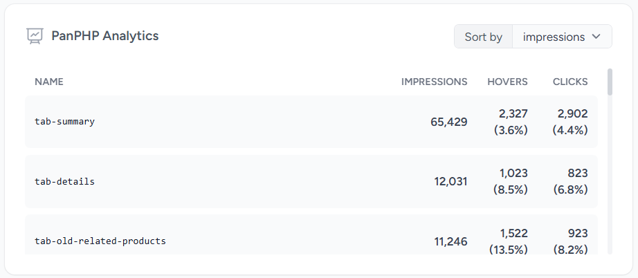

# A Laravel Pulse card displaying PanPHP analytics

[](https://packagist.org/packages/schmeits/pulse-panphp)
[](https://github.com/schmeits/pulse-panphp/actions?query=workflow%3Arun-tests+branch%3Amain)
[](https://packagist.org/packages/schmeits/pulse-panphp)

This pulse card displays the [Pan PHP Analytics](https://github.com/panphp/pan) information.



## Installation

You can install the package via composer:

```bash
composer require schmeits/pulse-panphp
```

## Usage

## Add to your dashboard

To add the card to the Pulse dashboard, you must first [publish the vendor view](https://laravel.com/docs/10.x/pulse#dashboard-customization).

Then, you can modify the `dashboard.blade.php` file:

```diff
<x-pulse>
+    <livewire:pulse.panphp cols='4' rows='2' />

    <livewire:pulse.servers cols="full" />

    <livewire:pulse.usage cols="4" rows="2" />

    <livewire:pulse.queues cols="4" />

    <livewire:pulse.cache cols="4" />

    <livewire:pulse.slow-queries cols="8" />

    <livewire:pulse.exceptions cols="6" />

    <livewire:pulse.slow-requests cols="6" />

    <livewire:pulse.slow-jobs cols="6" />

    <livewire:pulse.slow-outgoing-requests cols="6" />

</x-pulse>
```

## Testing

```bash
composer test
```

## Changelog

Please see [CHANGELOG](CHANGELOG.md) for more information on what has changed recently.

## Contributing

Please see [CONTRIBUTING](CONTRIBUTING.md) for details.

## Security Vulnerabilities

Please review [our security policy](../../security/policy) on how to report security vulnerabilities.

## Credits

- [Tally Schmeits](https://github.com/schmeits)
- [All Contributors](../../contributors)

## License

The MIT License (MIT). Please see [License File](LICENSE.md) for more information.
